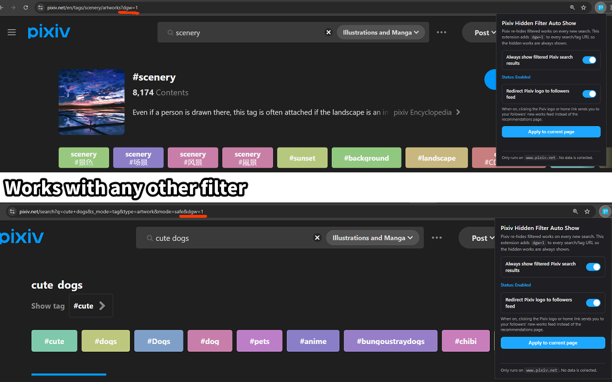
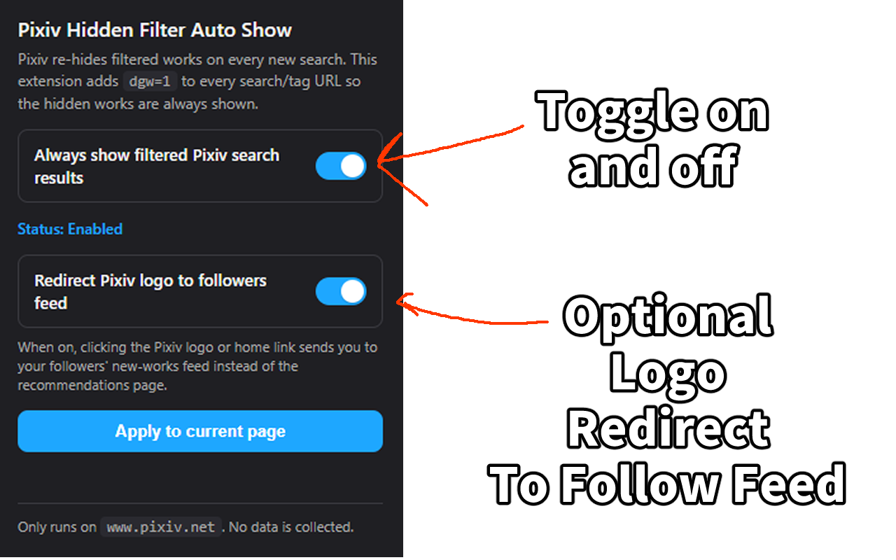

# Pixiv Hidden Filter Auto Show

**Permanently turn off Pixiv's "Works that may not be relevant to your
search" filter.** Pixiv hides a chunk of every search behind a banner that
reads *"Works that may not be relevant to your search"*, and **resets that
setting on every new search** — so even after you click "Show", the next
query hides the works again. This small Chrome + Firefox extension (Manifest
V3) fixes that for good: it automatically keeps the filter disabled (by
appending `dgw=1` to every Pixiv search and tag URL), so all results stay
visible on every search without you touching Search options ever again.

## Does this solve your problem?

This extension is for you if you've run into any of these on Pixiv:

- Pixiv shows **"Works that may not be relevant to your search"** and hides
  results you actually want to see.
- You set **Search options → Other → "Works that may not be relevant to your
  search" → Show**, but it **resets to "Hide" on the next search**.
- Pixiv is suddenly **showing fewer search results** than it used to.
- You want to **show all Pixiv search results** / **disable the relevance
  filter** / **stop Pixiv hiding works** permanently.

If any of those sound familiar, install it and forget about it — the filter
stays off automatically.

## Install

- **Chrome / Edge / Brave**: install from the
  [Chrome Web Store](https://chromewebstore.google.com/) once the listing
  is approved, or sideload the latest zip from the
  [GitHub Releases](https://github.com/TdogCreations/pixiv-hidden-filter-auto-show/releases)
  page (instructions below).
- **Firefox**: load the unpacked extension from
  [GitHub Releases](https://github.com/TdogCreations/pixiv-hidden-filter-auto-show/releases)
  (instructions below).

### Sideload on Chrome (from a GitHub release)

1. Download `pixiv-hidden-filter-auto-show-<version>.zip` from the
   [Releases](https://github.com/TdogCreations/pixiv-hidden-filter-auto-show/releases)
   page.
2. Unzip it anywhere on your computer.
3. Open `chrome://extensions` (or `edge://extensions`, `brave://extensions`).
4. Toggle **Developer mode** on (top right).
5. Click **Load unpacked** and select the unzipped folder (the one that
   contains `manifest.json`).

### Sideload on Firefox (from a GitHub release)

1. Download the zip from the
   [Releases](https://github.com/TdogCreations/pixiv-hidden-filter-auto-show/releases)
   page (you don't need to unzip it).
2. Open `about:debugging` → **This Firefox** → **Load Temporary Add-on...**.
3. Select the `manifest.json` inside the unzipped folder (or any file inside
   the zip after extracting it).

Firefox unloads temporary add-ons when it closes. For permanent install,
wait for the Firefox Add-ons store listing.

## Screenshots

The extension at work — `dgw=1` lands in the URL automatically across both
tag pages and search pages with other filters, and the previously-hidden
works appear in the results:



The popup, with the search filter toggle and the optional logo-redirect
toggle:



## What the extension does

- Runs only on `https://www.pixiv.net/*`.
- Detects Pixiv search and tag pages, including:
  - `https://www.pixiv.net/tags/.../artworks`
  - `https://www.pixiv.net/en/tags/.../artworks`
  - `https://www.pixiv.net/tags/.../illustrations`
  - `https://www.pixiv.net/en/tags/.../illustrations`
  - `https://www.pixiv.net/search.php?...`
  - Any Pixiv URL whose path contains `/tags/` or `/search`.
- If the URL is a Pixiv search/tag page and does not already contain
  `dgw=1`, the extension adds it while preserving every other query
  parameter.
- Handles Pixiv's SPA-style navigation by hooking `history.pushState`,
  `history.replaceState`, `popstate`, and `hashchange`.
- Provides a popup with:
  - The extension title.
  - A toggle: "Always show filtered Pixiv search results".
  - Status text: Enabled / Disabled.
  - A button: "Apply to current page".
- Stores the toggle state in `storage.sync`. Default state is **enabled**.

The extension does not scrape pages, does not collect user data, does not
contact any external server, and does not modify page content other than the
URL query parameter.

## File structure

```
.
├── manifest.json
├── src/
│   ├── page-world.js   ← runs in the page's JS world; patches history + fetch
│   ├── content.js      ← runs isolated; bridges storage / popup / page world
│   ├── popup.html
│   ├── popup.css
│   └── popup.js
├── icons/
│   └── icon.svg
└── README.md
```

## Browser requirements

The extension uses Manifest V3 with a content script declared in
`"world": "MAIN"` so it can hook Pixiv's own `history.pushState`,
`history.replaceState`, `fetch`, and `XMLHttpRequest`. Without this, Pixiv's
SPA code silently strips `dgw=1` back out after every search.

- **Chrome / Edge / Brave**: version 111 or newer (March 2023+).
- **Firefox**: version 128 or newer (July 2024+).

## Install (unpacked) in Chrome

1. Open `chrome://extensions` in Chrome (or any Chromium browser such as Edge
   or Brave).
2. Enable **Developer mode** (toggle in the top-right corner).
3. Click **Load unpacked**.
4. Select the folder that contains `manifest.json` (the root of this project).
5. Open a Pixiv search/tag page to confirm the extension is working.

## Install (temporary) in Firefox

1. Open `about:debugging` in Firefox.
2. Choose **This Firefox** in the left sidebar.
3. Click **Load Temporary Add-on...**.
4. Select the `manifest.json` file at the root of this project.

Firefox unloads temporary add-ons when it closes, so this is intended for
development/testing. For permanent installation, see "Publishing notes" below.

## How to test

1. Make sure the extension is enabled (open the popup; the toggle should be
   on and status should read "Enabled").
2. Open a Pixiv tag/search page, for example:
   `https://www.pixiv.net/en/tags/%E3%82%AA%E3%83%AA%E3%82%B8%E3%83%8A%E3%83%AB/artworks`
3. The URL should be rewritten to include `dgw=1`, e.g.:
   `https://www.pixiv.net/en/tags/.../artworks?dgw=1`
4. Confirm that previously hidden works appear in the result list.
5. Open the popup, turn the toggle **off**, and navigate to a different tag
   page. The URL should **not** be rewritten this time.
6. Turn the toggle back on, navigate to a Pixiv search page that does not
   yet have `dgw=1`, and click **Apply to current page** in the popup. The
   active tab should reload with `dgw=1` appended.

## Permissions used

- `storage` — to persist the on/off toggle.
- `tabs` — used only by the popup's **Apply to current page** button so it
  can identify the active tab and send a message to its content script.
- Host permission `https://www.pixiv.net/*` — to allow the content script to
  run on Pixiv pages.

No other permissions are requested.

## Publishing notes

### Chrome Web Store

1. Zip the contents of the project folder (not the folder itself — the
   `manifest.json` must sit at the root of the archive).
2. Create or sign in to a Chrome Web Store developer account
   (one-time registration fee may apply).
3. Upload the zip via the Chrome Web Store Developer Dashboard, fill in
   listing details, and submit for review.

### Firefox Add-ons (addons.mozilla.org)

1. Zip the contents of the project folder (again, `manifest.json` at the
   archive root).
2. Sign in at <https://addons.mozilla.org/developers/>.
3. Submit the zip for either self-distribution signing or listed
   distribution on AMO.

Both stores accept the same `manifest.json` thanks to the
`browser_specific_settings.gecko` block.

## Privacy note

- The extension stores exactly one setting locally: `enabled` (boolean).
- That setting may sync across the user's browser profile via
  `storage.sync`, which is provided by the browser itself.
- The extension does **not** collect, log, or transmit any user data.
- The extension does **not** contact any external server.
- The extension does **not** read Pixiv content, account information, or
  cookies. It only inspects and rewrites the URL of the page it is loaded on.

## License

MIT.
